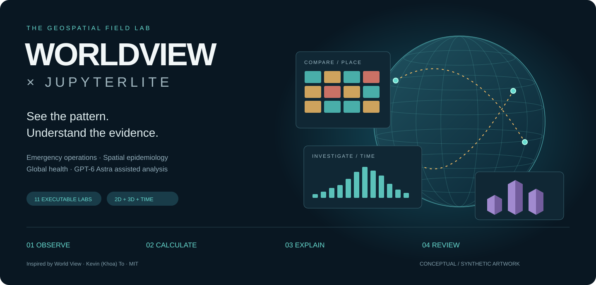
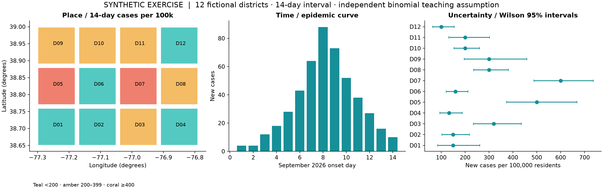
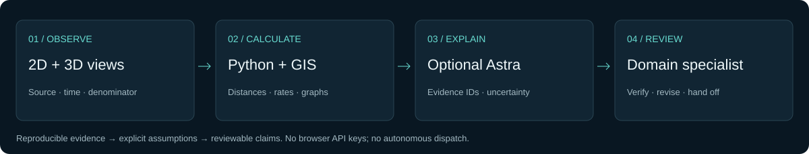

# JupyterLite WorldView · Geospatial Field Lab



**Explore emergency operations, spatial epidemiology, and global health in your browser.** Eleven executable notebooks connect reproducible Python analysis, a 2D EOC, Cesium 3D scenes, and optional GPT-6 Astra assisted interpretation. Each lab includes a mission, worked calculations, visualizations, exercises, checkpoints, and primary references.

**[Open the field lab](https://jltobias.github.io/JupyterLite-WorldView/) · [2D EOC](https://jltobias.github.io/JupyterLite-WorldView/dashboard/operations.html) · [3D scenes](https://jltobias.github.io/JupyterLite-WorldView/scenes/) · [JupyterLite](https://jltobias.github.io/JupyterLite-WorldView/lab/index.html) · [Jupyter Book](https://jltobias.github.io/JupyterLite-WorldView/book/)**

> Educational companion to [World View by Kevin (Khoa) To](https://github.com/kevtoe/worldview), not an official distribution. Health scenarios, facilities, road networks, and supply flights are **SYNTHETIC**. The public demo requires no API key. Optional Astra inference runs separately on your computer or a managed server.

## Explore the connected demos

| Experience | What you can do |
|---|---|
| [Exercise EOC](https://jltobias.github.io/JupyterLite-WorldView/dashboard/operations.html) | Switch cases, population-normalized measures, and reporting assumptions; move the onset-day slider; inspect a table; import/export GeoJSON. |
| [Cesium scene](https://jltobias.github.io/JupyterLite-WorldView/scenes/) | Compare 3D, 2D, and Columbus view; explore rate extrusions; animate a CZML supply flight; import notebook layers. |
| [Public-feed dashboard](https://jltobias.github.io/JupyterLite-WorldView/dashboard/) | View USGS earthquakes and the public ISS endpoint when available, alongside explicitly simulated aircraft. |
| [Astra workflow](https://jltobias.github.io/JupyterLite-WorldView/book/astra.html) | Assemble evidence, critique map/chart interpretations, draft cited briefings, and validate structured output. |
| [Field guide and glossary](https://jltobias.github.io/JupyterLite-WorldView/book/) | Read the full rendered notebooks, EOC exercise, methods, architecture, sources, and 50-term glossary. |



The atlas is generated from the bundled fixture by [`scripts/make_assets.py`](scripts/make_assets.py). It represents invented data, not an observed outbreak. Three views make different questions visible: **where, when, and how uncertain**.

## Run a lab

Open a notebook, choose **Python (Pyodide)**, and use **Run → Run All Cells**. First use downloads Python/Matplotlib resources; allow time for the kernel to start. Each notebook runs independently. Returning users: JupyterLite retains browser copies of files. Export your work before clearing site data, or open a private window to load the newly bundled versions. Download exports using the displayed link or the JupyterLite file browser, then import GeoJSON into either viewer. A browser filesystem is separate from your local disk.

| Launch in JupyterLite | Inspect on GitHub |
|---|---|
| [00 · See, calculate, explain](https://jltobias.github.io/JupyterLite-WorldView/lab/index.html?path=00_start_here.ipynb) | [Source](content/00_start_here.ipynb) |
| [01 · Live seismic data, honest freshness](https://jltobias.github.io/JupyterLite-WorldView/lab/index.html?path=01_live_seismic.ipynb) | [Source](content/01_live_seismic.ipynb) |
| [02 · Read the common operating picture](https://jltobias.github.io/JupyterLite-WorldView/lab/index.html?path=02_worldview_dashboard.ipynb) | [Source](content/02_worldview_dashboard.ipynb) |
| [03 · Build a portable geospatial layer](https://jltobias.github.io/JupyterLite-WorldView/lab/index.html?path=03_build_your_own_layer.ipynb) | [Source](content/03_build_your_own_layer.ipynb) |
| [04 · EOC: proximity, capacity, and a briefing](https://jltobias.github.io/JupyterLite-WorldView/lab/index.html?path=04_eoc_response.ipynb) | [Source](content/04_eoc_response.ipynb) |
| [05 · Outbreak investigation: counts, rates, uncertainty](https://jltobias.github.io/JupyterLite-WorldView/lab/index.html?path=05_spatial_epidemiology.ipynb) | [Source](content/05_spatial_epidemiology.ipynb) |
| [06 · Global health: access when roads close](https://jltobias.github.io/JupyterLite-WorldView/lab/index.html?path=06_health_access.ipynb) | [Source](content/06_health_access.ipynb) |
| [07 · 3D scenes, extrusion, and time](https://jltobias.github.io/JupyterLite-WorldView/lab/index.html?path=07_3d_scenes.ipynb) | [Source](content/07_3d_scenes.ipynb) |
| [08 · Astra: evidence in, reviewable briefing out](https://jltobias.github.io/JupyterLite-WorldView/lab/index.html?path=08_astra_geospatial_copilot.ipynb) | [Source](content/08_astra_geospatial_copilot.ipynb) |
| [09 · Raster change and multimodal interpretation](https://jltobias.github.io/JupyterLite-WorldView/lab/index.html?path=09_raster_change.ipynb) | [Source](content/09_raster_change.ipynb) |
| [10 · Capstone: an evidence-based shift handoff](https://jltobias.github.io/JupyterLite-WorldView/lab/index.html?path=10_capstone.ipynb) | [Source](content/10_capstone.ipynb) |

Start with 00–03 for mapping foundations, 04–06 for EOC and health analysis, 07–09 for 3D and AI, and 10 for the capstone. The seismic notebook defaults to a deterministic **synthetic fallback**; set `USE_LIVE = True` to request USGS data. It never passes the fallback off as observed data.

## What Astra adds

The official [GPT-6 Astra model documentation](https://developers.openai.com/api/docs/models/gpt-6-astra) supports reasoning, coding, image input, function calling, and structured outputs. These labs apply them to GIS code review, chart interpretation, evidence synthesis, and communication. Exact distances, denominators, network costs, and raster areas are calculated in code. [Vision limitations](https://developers.openai.com/api/docs/guides/images-vision) mean image interpretation must be checked against those calculations. Documentation checked **2026-10-02**.



Lab 08 constructs a real Responses API request using `gpt-6-astra`, while its default validation exercise uses an explicitly authored fixture. For optional live inference, download an evidence bundle, set `OPENAI_API_KEY` only in your local/server environment, and run:

```bash
python tools/astra_brief.py --evidence astra-evidence.json --output artifacts/request.json --dry-run
python tools/astra_brief.py --evidence astra-evidence.json --output artifacts/brief.json
```

Add `--image raster-change.png` for a reviewed synthetic map or chart. The first command makes no API call; the second uses your account and applicable API charges. No key belongs in JupyterLite, a browser bundle, or a committed notebook. The runner checks schema, completion, refusals, and evidence IDs, and saves audit metadata. It cannot prove that every claim is correct. See the [integration guide](book/astra.md).

## Connect to the original World View

This repository implements a static teaching companion. It does not bundle World View's React/Express application or its live credentialed services. To load notebook exports in the original Cesium/Resium application, use the [NotebookLayer adapter and instructions](integrations/worldview/README.md). The adapter was written against upstream revision `db607a44f15c037fefc4969a7fd607d7f625c171`; review compatibility when updating upstream.

## Build and verify

Python 3.12 is used in CI. The commands below work on Windows, macOS, and Linux:

```bash
python -m pip install -r requirements-dev.txt
python -m pytest -q
python scripts/execute_notebooks.py
python scripts/build_site.py
python -m http.server --directory dist 8000
```

Open `http://localhost:8000`. `build_site.py` recreates this checkout's `dist/` and `book/_build/`, copies the canonical notebooks into the book, and builds JupyterLite and Jupyter Book. To refresh committed notebook outputs after an edit, run `python scripts/execute_notebooks.py --write`. To regenerate synthetic fixtures or artwork, run `python scripts/generate_data.py` or `python scripts/make_assets.py` deliberately; the notebooks themselves are the canonical lab source.

Browser checks: `python -m playwright install chromium`, then `python scripts/check_browser.py`. The check serves the site under a repository subpath and exercises filters, imports, errors, 3D, and responsive layouts. On Windows it can also use installed Chrome/Edge. Generated verification artifacts stay under ignored `artifacts/`.

Pushes to `main` test, build, and deploy through GitHub Actions; pull requests test and build without deployment. Configure GitHub Pages with **Source: GitHub Actions**. External CDNs, map tiles, and live endpoints need network access; the project does not promise offline maps or a production EOC service.

## Sources, attribution, and licenses

**World View:** [source](https://github.com/kevtoe/worldview), [live application](https://worldview.khoa.to/), [upstream MIT license](https://github.com/kevtoe/worldview/blob/main/LICENSE). Copyright © 2026 **Kevin (Khoa) To**. Its situational-awareness design and Cesium architecture inspired this separate educational implementation. The complete upstream notice is preserved in [`licenses/WORLDVIEW-MIT.txt`](licenses/WORLDVIEW-MIT.txt). No affiliation or endorsement is claimed.

**Methods:** [WHO EOC framework](https://www.who.int/publications/i/item/framework-for-a-public-health-emergency-operations-centre), [CDC descriptive epidemiology](https://www.cdc.gov/field-epi-manual/php/chapters/describing-epi-data.html), [NIST Wilson intervals](https://www.itl.nist.gov/div898/handbook/prc/section2/prc241.htm), [WHO AccessMod context](https://www.who.int/tools/accessmod-geographic-access-to-health-care), [USGS GeoJSON](https://earthquake.usgs.gov/earthquakes/feed/v1.0/geojson.php), [GeoJSON RFC 7946](https://www.rfc-editor.org/rfc/rfc7946), and [Cesium documentation](https://cesium.com/learn/cesiumjs/ref-doc/). See the [full reference register](book/references.md) for additional citations. Cited institutions did not provide the synthetic scenarios.

**Software and service credits:** CesiumJS — Apache-2.0; Leaflet — BSD-2-Clause; JupyterLite/JupyterLab/Jupyter Book — BSD-3-Clause; Pyodide — MPL-2.0; NumPy — BSD-3-Clause; Matplotlib — its PSF-based license. OpenStreetMap contributors — ODbL map data, with separate tile-use requirements; CARTO — basemap service attribution/terms; Natural Earth — public-domain imagery; USGS and Where the ISS At — their respective live data/service terms. Dependency licenses do not grant rights to provider data or services.

**This companion's original code, notebooks, documentation, synthetic fixtures, and original vector/plot artwork are MIT-licensed**, copyright © 2026 James Tobias and JupyterLite WorldView contributors; see [`LICENSE`](LICENSE). Original figures contain no copied upstream screenshots or organizational logos. Third-party rights remain separate; consult [`THIRD_PARTY_NOTICES.md`](THIRD_PARTY_NOTICES.md) and [`licenses/`](licenses/). Cite the companion using [`CITATION.cff`](CITATION.cff), and cite World View separately when discussing its contribution.
